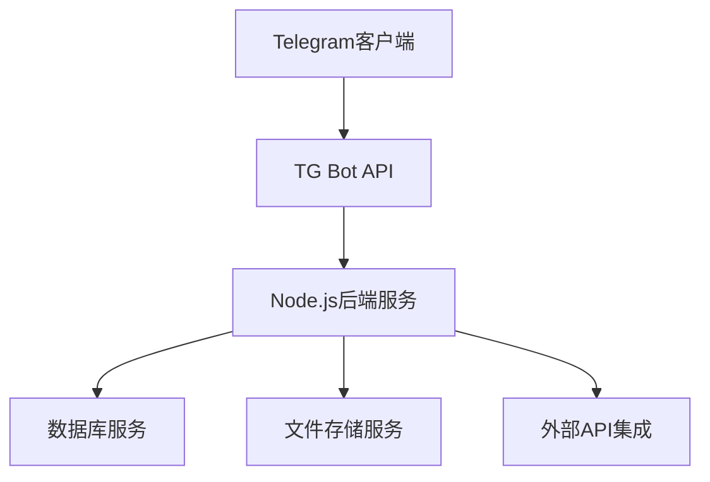

## 产品概述

TG Content Bot Pro 是一个Telegram内容机器人项目，需要优化部署配置和功能完善，确保在pull分支上稳定运行。

## 核心功能

- 检查当前pull分支的部署配置状态
- 优化项目部署流程和配置文件
- 完善机器人基础功能模块
- 确保项目在目标环境稳定运行
- 验证各功能模块的完整性

## 技术栈

- 后端框架：Node.js + TypeScript
- Telegram Bot API集成
- 数据库：MongoDB/PostgreSQL
- 部署环境：云服务器/Docker容器
- 配置管理：环境变量配置文件

## 系统架构



## 模块划分

- **配置管理模块**：环境配置、部署配置检查
- **机器人核心模块**：消息处理、命令解析
- **数据持久化模块**：数据库连接、数据操作
- **部署优化模块**：容器配置、性能监控

## 核心目录结构

```
tg-content-bot-pro/
├── src/
│   ├── config/          # 配置文件
│   ├── bot/             # 机器人核心逻辑
│   ├── services/        # 业务服务层
│   ├── models/          # 数据模型
│   ├── utils/           # 工具函数
│   └── types/           # TypeScript类型定义
├── deployment/          # 部署配置
├── scripts/            # 部署脚本
└── package.json
```

## 代理扩展

### SubAgent

- **code-explorer** (来自 <subagent>)
- 用途：全面扫描项目代码，检查pull分支的当前状态和配置完整性
- 预期结果：生成详细的代码结构分析报告，识别部署配置问题和功能缺失

### Skill

- **skill-creator** (来自 <skills>)
- 用途：分析和优化现有的技能配置，确保部署相关的技能模块完整可用
- 预期结果：完善部署优化相关的技能配置，提升自动化部署能力